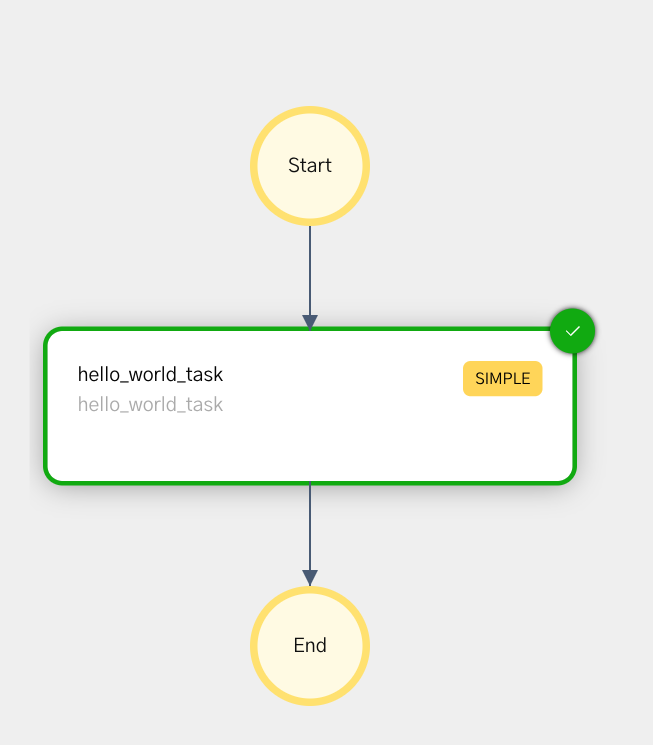

# Java Quickstart Example
This repository contains sample applications that demonstrates the various features of Conductor Java SDK.

### Running Example

> **Note**
Obtain KEY and SECRET from the playground or your Conductor server

Export variables
```shell
export KEY=
export SECRET=
export CONDUCTOR_SERVER_URL=https://play.orkes.io/api
```

Run the main program
```shell
./gradlew run

```

## Workflow
We create a simple 2-step workflow that fetches the user details and sends an email.

<table><tr><th>Visual</th><th>Code</th></tr>

<tr>
<td width="220px"></td>
<td>
<pre>
    ConductorWorkflow<WorkflowInput> workflow = new ConductorWorkflow<>(executor);
    workflow.setName("email_send_workflow");
    workflow.setVersion(1);

    // Step 1, get user details
    // The implementation is in
    // io.orkes.samples.quickstart.workers.ConductorWorkers.getUserInfo.
    // In production case, the workers are deployed separately and scaled based on the workload
    SimpleTask getUserDetails = new SimpleTask("get_user_info", "get_user_info");
    getUserDetails.input("userId", "${workflow.input.userId}");

    // send email
    SimpleTask sendEmail = new SimpleTask("send_email", "send_email");
    // get user details user info, which contains the email field
    sendEmail.input("email", "${get_user_info.output.email}");

    workflow.add(getUserDetails);
    workflow.add(sendEmail);
</pre>
</td>
</tr>
</table>


## Worker
Workers are implemented as simple functions with sample implementation.  
See [ConductorWorkers.java](src/main/java/io/orkes/samples/quickstart/workers/ConductorWorkers.java) for details.

## Executing Workflows
There are two ways to execute a workflow:
1. Synchronously - useful for short duration workflows that completes within a few second.  
2. Asynchronously - workflows that runs for longer period

### Synchronous Workflow Execution
There are two methods that provides synchronous workflow execution, these methods are avaialble in `WorkflowClient` and `ConductorWorkflow` class.

```java
ConductorWorkflow<?>.executeDynamic();
ConductorWorkflow<?>.execute()
```

### Asynchronous Workflow Execution
```java
WorkflowClient#startWorfklow(...)
```

See [Main.java](src/main/java/io/orkes/samples/quickstart/Main.java) for complete code sample of workflow execution.

