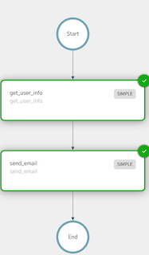

# Java Quickstart Example
This in example, we demonstrate how to create a simple workflow
and write a simple test that validates the workflow defintion and its execution


### Running Example

> **Note**
Obtain KEY and SECRET from the playground or your Conductor server

Export variables
```shell
export KEY=
export SECRET=
export CONDUCTOR_SERVER_URL=https://play.orkes.io/api
```

Run the main program
```shell
./gradlew run

```

## Worker
See [HelloWorld.java](src/main/java/io/orkes/samples/quickstart/HelloWorld.java) for the Worker implementation

## Workflow Management
See [WorkflowManagement.java](src/main/java/io/orkes/samples/quickstart/WorkflowManagement.java) 
for example of how to create a workflow definition form a JSON file and execute a workflow.

## Workflow Definition

```json
{
  "name": "HelloWorld",
  "description": "Hello Workflow!",
  "version": 1,
  "tasks": [
    {
      "name": "hello_world_task",
      "taskReferenceName": "hello_world_task",
      "inputParameters": {
        "name": "${workflow.input.name}"
      },
      "type": "SIMPLE",
      "optional": false
    }
  ],
  "outputParameters": {
    "workflow_output": "${hello_world_task.output}"
  },
  "schemaVersion": 2,
  "restartable": true,
  "workflowStatusListenerEnabled": false,
  "ownerEmail": "viren@orkes.io",
  "timeoutPolicy": "ALERT_ONLY"
}
```

